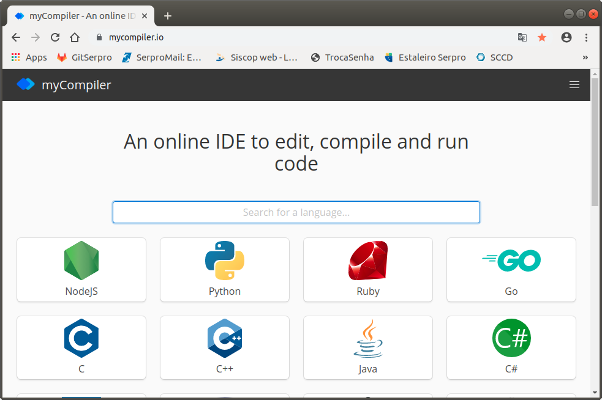

(c) **Cleuton Sampaio** 2018

# História e contexto

[**Go**](http://golang.org) é uma linguagem de programação [**compilada**](https://pt.wikipedia.org/wiki/Linguagem_compilada) criada pela **Google** em 2009. 

Possui semelhanças com **C** e **Java**, mas também com **Python**. Ao contrário de Java, não te obriga a criar uma classe para criar uma aplicação. 

Muitos desenvolvedores chamam esta linguagem de **golang**, em vez de simplesmente **Go**. Mas pode haver uma razão para isto, já que existe uma linguagem de programação [**Go!**](https://en.wikipedia.org/wiki/Go!_(programming_language)) (com exclamação) criada em 2003 por Francis McCabe e Keith Clark.

**Por que outra linguagem?**

Bom, há várias explicações para isto, mas o principal diferencial da **Golang** é ser compilada e focada em produtividade, ao contrário de outras linguagens compiladas, como **C++**. Como a maioria das linguagens de programação moderna são interpretadas (mesmo as baseadas em Máquinas Virtuais), ter uma linguagem de programação com sintaxe moderna e compilada, é uma vantagem para os desenvolvedores. 

Outra razão é que ela possui recursos para [**programação concorrente**](https://pt.wikipedia.org/wiki/Programa%C3%A7%C3%A3o_concorrente). 

A [**Wikipedia**](https://en.wikipedia.org/wiki/Go_(programming_language)) tem uma excelente resposta para esta pergunta: 

```
Go foi criada na Google em 2007 para melhorar a produtividade da programação, em uma era de máquinas com múltiplos processadores e ligadas em rede, além de bancos de dados enormes. Os criadores queriam resolver as críticas de outras linguagens utilizadas na Google, mas manter suas características úteis: 

- Tipagem estática e eficiência em tempo de execução (como C++);
- Facilidade de leitura e usabilidade (como: Python ou JavaScript);
- Rede e multiprocessamento de alto desempenho;
- Os criadores estavam motivados principalmente pelo seu desgosto compartilhado pelo C++;
```

## Amostra grátis

Vamos começar? Aprender uma linguagem nova é algo bem estressante, portanto, vamos evitar coisas demais logo no início. Tem um "atalho" que eu gosto muito que é o [**MyCompiler.io**](https://www.mycompiler.io/). 



É uma espécie de IDE online, que nos permite criar e executar código em várias linguagens, incluindo **golang**. Eu recomendo que você se cadastre e faça **login**, para poder salvar seu código. Depois, escolha **Go** e digite o programa [**inicio.go**](./codigo/inicio.go).

```
package main

import (
	"fmt"
	"time"
)

func main() {

	timeNow := time.Now()
	fmt.Println("Current time: ", timeNow.String())
}
```

Digite este programa no **MyCompiler** e execute: 


## Vamos por partes

Todo programa **golang** tem a mesma estrutura: Declaração de pacote, *imports* e função principal. E é exatamente assim que o nosso programa está dividido. 

Para começar, declaramos um pacote chamado **main**. Poderia ser outro nome, caso quiséssemos criar uma biblioteca de funções, porém, como meu objetivo é criar um programa executável, eu tenho que colocá-lo dentro de um pacote **main** (veremos isso mais adiante).

```
package main
```

Depois, eu posso importar código de outros pacotes, de maneira semelhante ao que fazemos em **Java** ou **Python**. Estou importanto dois pacotes da [**biblioteca padrão da golang**](https://golang.org/pkg/): *fmt* e *time*. 

```
import (
	"fmt"
	"time"
)
```

Finalmente, eu crio uma **função** chamada **main** e, dentro de seu corpo, coloco os comandos que eu quero executar: 

```
func main() {

	timeNow := time.Now()
	fmt.Println("Current time: ", timeNow.String())
}
```

Ok. Como este código é executado? Em **golang** todo pacote chamado **main** gera um executável, e deve possuir uma função chamada **main**. Por exemplo, tente mudar o nome da função para ver o que acontece...

```
runtime.main_main·f: function main is undeclared in the main package
```

## Desafio

Modifique o programa para exibir a data no formato Brasileiro: **dd/mm/aaaa hh:mm:ss**.
(dica: https://golang.org/pkg/time/#Time.Format).

