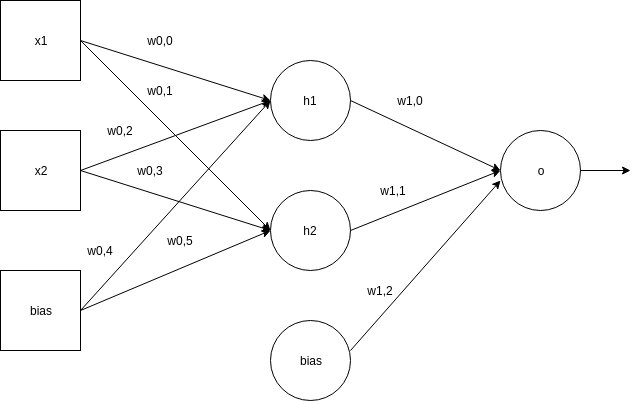

(c) **Cleuton Sampaio** 2019

# Redes neurais com Gorgonia


[**Deep learning** e redes neurais](https://github.com/cleuton/neuraljava) são um assunto muito interessante e a linguagem **Go** dá suporte a essa tecnologia, com o uso do framework [**Gorgonia**](https://github.com/gorgonia).

**Gorgonia** funciona como frameworks semelhantes, por exemplo, o [**Tensorflow**](https://www.tensorflow.org/), permitindo a criação de [**grafos**](https://pt.wikipedia.org/wiki/Teoria_dos_grafos) de operações e [**tensores**](https://pt.wikipedia.org/wiki/Tensor). 

Ainda não existe algo como o [**Keras**](https://keras.io/) para **Gorgonia**, embora o projeto [**Golgi**](https://github.com/gorgonia/golgi) seja promissor.

A programação é um pouco baixo nível, pois temos que criar os grafos contendo as operações e os tensores, portanto, não existe o conceito de **neurônio** nem de **camadas**, existente em outros frameworks.

Neste post, vou mostrar um exemplo bem básico de [**MLP** - Multilayer Perceptron](https://github.com/cleuton/neuraljava) tentando encontrar os pesos para uma aproximação da função de [**disjunção exclusiva** ou XOR](https://pt.wikipedia.org/wiki/Porta_XOR).

## Instalação

Primeiramente, temos que instalar as bibliotecas necessárias. Ah, e para começar, seu ambiente **Go** tem que ser 1.12 ou superior!

```
$ go version
go version go1.13.5 linux/amd64
```

Depois, instale o pacote com as dependências: 

```
go get gorgonia.org/gorgonia
```

Há vários pacotes auxiliares interessantes, como o 

- [**gonum**](https://github.com/gonum): Que é uma biblioteca matemática semelhante ao [**numpy**](https://numpy.org/);
- [**gota**](https://github.com/go-gota/gota): Algo semelhante ao [**pandas**](https://pandas.pydata.org/);


Mas, neste exemplo, usaremos só o **gorgonia**.

## O exemplo

Teremos uma rede com duas camadas, conforme o modelo: 


Neste modelo, para simplificar as coisas, não inclui os [**bias**](https://github.com/cleuton/neuraljava), o que pode fazer a rede demorar um pouco mais para convergir, mas, um modelo melhor seria assim: 



Temos uma sequência de entrada de 4 pares de números: {1,0},{0,1},{1,1},{0,0}, ou seja, com **shape** 4,2 (quatro linhas e duas colunas). São dois nós de entrada, com quatro repetições. 

Para isto, teremos uma [**camada oculta**]() de 2 nós, portanto, teremos uma matriz de pesos com **shape** 2,2 (duas linhas e duas colunas), entre as entradas e a camada oculta.

E temos um nó de saída, portanto, temos uma coluna de pesos com **shape** 2. 

O resultado esperado de uma operação de **XOR** seria assim: {1,1,0,0}.

## Montagem e treinamento do modelo

O [**arquivo exemplo**](https://github.com/cleuton/golang-network/blob/master/code/deeplearning1/mlp.go) importa as bibliotecas necessárias. Começarei com a parte interessante, que é criar uma struct para representar nosso modelo de rede neural: 

```
type nn struct {
	g      *ExprGraph
	w0, w1 *Node

	pred    *Node
	predVal Value
}
```

Esta struct contém ponteiros para o grafo de operações (g), para os nós das camadas de pesos (w0 - entrada/hidden e w1 - hidden/saída), o nó de saída (pred) e seu valor (predVal).

Criei um método para retornar as matrizes de pesos, ou **learnables**, que serão aquilo que o modelo terá que aprender. Isso facilita muito a parte de [**Backpropagation**](https://github.com/cleuton/neuraljava):

```
func (m *nn) learnables() Nodes {
	return Nodes{m.w0, m.w1}
}
```

E criei um [**factory method**](https://pt.wikipedia.org/wiki/Factory_Method) para instanciar uma rede neural: 

```
func newNN(g *ExprGraph) *nn {
	// Create node for w/weight
	w0 := NewMatrix(g, dt, WithShape(2, 2), WithName("w0"), WithInit(GlorotN(1.0)))
	w1 := NewMatrix(g, dt, WithShape(2, 1), WithName("w1"), WithInit(GlorotN(1.0)))
	return &nn{
		g:  g,
		w0: w0,
		w1: w1}
}
```

Aqui, criamos duas matrizes gorgonia, informando seus **shapes** e inicializando com números aleatórios (usando o algoritmo Glorot). 

Só estamos criando nós no grafo! Nada será realmente executado pelo **gorgonia**!

Criei um método para o [**Forward propagation**](https://github.com/cleuton/neuraljava) que recebe o vetor de entradas e passa os elementos por toda a rede: 

```
func (m *nn) fwd(x *Node) (err error) {
	var l0, l1, l2 *Node
	var l0dot, l1dot *Node


	// Camada de input
	l0 = x

	// Multiplicação pelos pesos e sigmoid
	l0dot = Must(Mul(l0, m.w0))

	// Input para a hidden layer
	l1 = Must(Sigmoid(l0dot))

	// Multiplicação pelos pesos:
	l1dot = Must(Mul(l1, m.w1))

	// Camada de saída:
	l2 = Must(Sigmoid(l1dot))

	m.pred = l2
	Read(m.pred, &m.predVal)
	return nil

}
```

Multiplicamos as entradas pelos pesos, calculamos o [**Sigmoid**](https://github.com/cleuton/neuraljava) e passamos para a camada oculta, chegando até ao final. 

Finalmente, no método **main()** instanciamos nosso vetor de entrada e nosso vetor de resultados: 

```
	// Set input x to network
	xB := []float64{1,0,0,1,1,1,0,0}
	xT := tensor.New(tensor.WithBacking(xB), tensor.WithShape(4, 2))
	x := NewMatrix(g,
		tensor.Float64,
		WithName("X"),
		WithShape(4, 2),
		WithValue(xT),
	)

	// Define validation data set
	yB := []float64{1, 1, 0, 0}
	yT := tensor.New(tensor.WithBacking(yB), tensor.WithShape(4, 1))
	y := NewMatrix(g,
		tensor.Float64,
		WithName("y"),
		WithShape(4, 1),
		WithValue(yT),
	)
```

Colocamos a operação de **Forward pass** no grafo: 

```
// Run forward pass
if err := m.fwd(x); err != nil {
    log.Fatalf("%+v", err)
}
```

Calculamos a perda com [**MSE**](https://github.com/cleuton/neuraljava)

```
// Calculate Cost w/MSE
losses := Must(Sub(y, m.pred))
square := Must(Square(losses))
cost := Must(Mean(square))
```

Colocamos a operação de cálculo dos gradientes e **Backpropagation** no grafo: 

```
// Do Gradient updates
if _, err = Grad(cost, m.learnables()...); err != nil {
    log.Fatal(err)
}
```

E finalmente, instanciamos uma **máquina virtual** do Gorgonia e comandamos a execução do grafo: 

```
// Instantiate VM and Solver
vm := NewTapeMachine(g, BindDualValues(m.learnables()...))
solver := NewVanillaSolver(WithLearnRate(0.1))

for i := 0; i < 10000; i++ {
    vm.Reset()
    if err = vm.RunAll(); err != nil {
        log.Fatalf("Failed at inter  %d: %v", i, err)
    }
    solver.Step(NodesToValueGrads(m.learnables()))
    vm.Reset()
}
fmt.Println("\n\nOutput after Training: \n", m.predVal)
```

Repetimos o treinamento por várias vezes, executando o grafo com o comando **vm.RunAll()**.

Eis o resultado após o treinamento: 

```
Output after Training: 
 C[ 0.6267103873881292   0.6195071561964745  0.47790055401989834   0.3560452019123115]
```

Dá para montar qualquer tipo de rede com o **gorgonia**, mas eu quis mostrar este exemplo simples para começar.

