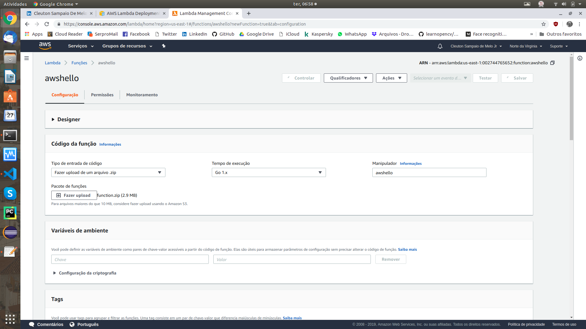
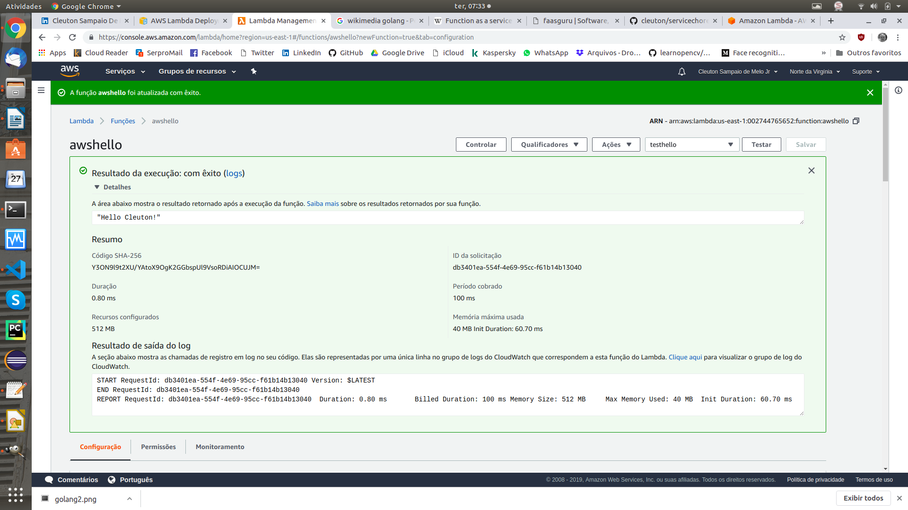

(c) **Cleuton Sampaio** 2018

## GO LAMBDA!


[**FaaS** ou *Function as a Service*](https://en.wikipedia.org/wiki/Function_as_a_service) é uma maneira de expor um serviço através e uma função, sem a complexidade de lidar com servidores, plataformas e protocolos. Na verdade, eu tenho um blog dedicado sobre o assunto: [**faas.guru**](http://faas.guru).


Se desejarmos expor uma função de negócio usando as tecnologias padrões, como: **REST**, **gRPC** ou mesmo [**Coreografia de serviços com fila**](https://github.com/cleuton/servicechoreography), teremos grande parte de código **boilerplate** em nosso projeto, ou seja: **Complexidade acidental**. Este código não agrega valor à função, mas nem por isso é inócuo! Pode gerar grandes prejuízos!

**FaaS** ou **Serverless** é uma alternativa para concentrarmos naquilo que realmente importa, e que nos trará lucro, deixando a infraestrutura totalmente a cargo do provedor de nuvem.

## AWS Lambda

O serviço [**AWS lambda**](https://aws.amazon.com/pt/lambda/) nos permite criarmos código em várias linguagens (Java, Python, javascript, Go etc) e subirmos para a plataforma, sem nos preocuparmos com a parte de infraestrutura. 

Vamos criar um exemplo bem simples, na verdade baseado no próprio exemplo da AWS. Veja o [**arquivo fonte**](../../code/golambda/awshello.go):

```
package main

import (
	"fmt"
	"context"
	"github.com/aws/aws-lambda-go/lambda"
)

type MyEvent struct {
	Name string `json:"name"`
}

func HandleRequest(ctx context.Context, name MyEvent) (string, error) {
	return fmt.Sprintf("Hello %s!", name.Name ), nil
}

func main() {
	lambda.Start(HandleRequest)
}

```

O código inicia uma função **HandleRequest()** que simplesmente recebe uma **struct** contendo um string **JSON**. Ela apenas retorna uma saudação. Mas poderia fazer qualquer coisa, por exemplo: Acessar um banco **DynamoDB** por exemplo. 

## Compilando

Primeiro, você precisa instalar o pacote **aws-lambda-go**: 

```
go get github.com/aws/aws-lambda-go/lambda
```

Depois, é necessário compilar o projeto: 

```
GOOS=linux go build awshello.go
```

Então, precisa criar um **ZIP** com o seu projeto. O nome do ZIP tem que ser o nome do executável gerado (no nosso caso "awshello"): 

```
zip function.zip awshello
```

## Exportando

Para colocar seu pacote no ar, há duas opções: usar o **AWS CLI** ou a **AWS Console**. A não ser que vocẽ esteja utilizando algum tipo de **Continuous Delivery**, a Console é mais simples. Acesse a console e busque o serviço **AWS Lambda**. Crie uma função usando o **Runtime Go**: 


Depois, faça upload do arquivo zip: 



Configure um evento JSON de teste: 


E execute sua função: 



Depois, você pode configurar um **Evento** dos serviços AWS para disparar sua função, ou pode criar uma rota usando o **AWS API Gateway**.

